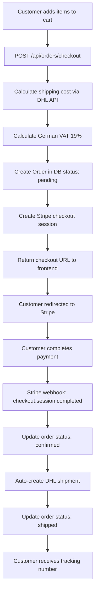
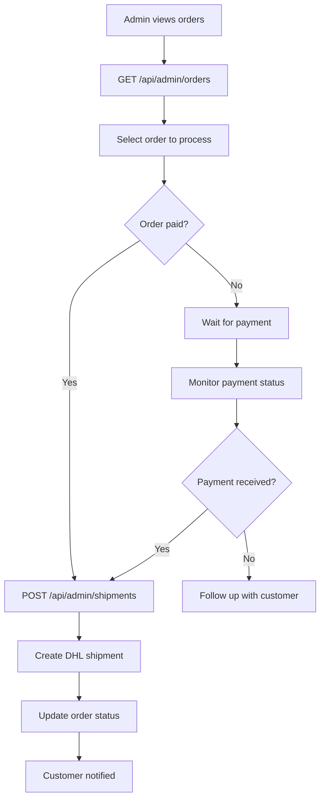
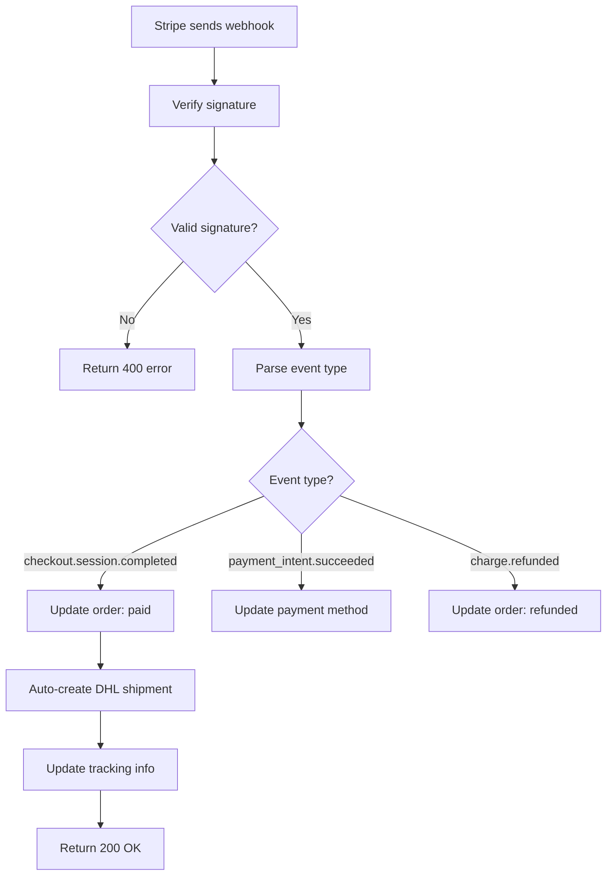

# � FlipPiece Backend — Complete System Review Guide

Hey Yannick! 👋

This is a comprehensive review guide for the FlipPiece e-commerce backend, focusing heavily on the **DHL** and **Stripe** integrations which are the core of the system.
---

## 🚀 **Quick Navigation - Jump to Key Sections**

### **🔄 Process Workflows**

- [Complete Order Processing Workflow](#workflow-1-customer-places-order) - End-to-end order flow
- [Admin Order Management Workflow](#workflow-2-admin-order-management) - Admin operations
- [Webhook Processing Workflow](#workflow-3-webhook-processing) - Real-time event handling

### **📋 API Documentation & Integration**
- [External API Documentation & Usage](#-external-api-documentation--usage) - Firebase, Stripe, DHL APIs
- [API Integration Flow Diagrams](#-api-integration-flow-diagrams) - Visual integration flows
- [Testing External Integrations](#-testing-external-integrations) - Testing strategies

### **🎯 Review Focus Areas**
- [Stripe Integration Deep Dive](#-stripe-integration-deep-dive) - Payment processing
- [DHL Integration Deep Dive](#-dhl-integration-deep-dive) - Shipping management
- [Database Schema for Integrations](#️-database-schema--order-management) - Data structure

---
## 🏗️ System Architecture Overview

**Core Stack**: Node.js + Express + PostgreSQL + Sequelize
**Key Integrations**: Firebase Auth + Stripe Payments + DHL Shipping

### 🗂️ Project Structure
- **/models** — Sequelize models (User, Product, Order, Gallery) - **No OrderItem table** (using JSON storage)
- **/controllers** — Route logic for each resource
- **/services** — **Critical**: Business logic and external API calls (DHL, Stripe)
- **/routes** — Express route definitions (public + admin routes)
- **/middlewares** — Validation, authentication, admin checks, file uploads
- **/config** — Environment and third-party config (Firebase, DHL, Stripe)
- **/tests** — Automated tests (Jest)
- **/migrations** — Database schema migrations
- **/utils** — Utility functions

---

## 🎯 **PRIMARY FOCUS: DHL & Stripe Integration Review**

### 💳 **Stripe Integration Deep Dive**

#### **1. Checkout Session Creation** (`services/checkout.service.js`)
```javascript
// Creates comprehensive checkout with detailed line items
exports.createCheckoutSession = async (orderData, successUrl, cancelUrl, orderId, email)
```

**Key Features:**
- ✅ Multiple payment methods: `card`, `sepa_debit`, `giropay`, `sofort`, `paypal`
- ✅ Detailed line items breakdown (products, shipping, VAT separately)
- ✅ Order total validation (prevents price manipulation)
- ✅ Shipping address collection for German/EU customers
- ✅ Proper metadata linking to order ID

**Review Focus:**
- Check line item calculation accuracy
- Verify URL validation and security
- Confirm metadata includes all necessary order info

#### **2. Webhook Processing** (`services/webhook.service.js`)
```javascript
// Handles real-time payment status updates
exports.handleCheckoutSessionCompleted = async (session)
exports.handlePaymentIntentSucceeded = async (intent)
exports.handlePaymentIntentFailed = async (intent)
```

**Key Features:**
- ✅ **Automatic order status updates** when payment succeeds
- ✅ **Auto-DHL shipment creation** for paid orders
- ✅ **Duplicate processing prevention** (idempotency)
- ✅ **SEPA payment method handling** (processing vs paid status)

**Review Focus:**
- Test webhook signature validation(already done, a quick read through should be enough)
- Verify order status synchronization(also done)
- Check DHL auto-shipment creation flow

#### **3. Customer Management** (`services/checkout.service.js`)
```javascript
// Creates Stripe customers for returning users
exports.createStripeCustomer = async (user)
```

### 🚚 **DHL Integration Deep Dive**

#### **1. Shipment Creation** (`services/dhl.service.js`)
```javascript
// Creates DHL shipments from order data
exports.createShipmentFromOrder = async (order)
exports.createShipment = async (shipmentData)
```

**Key Features:**
- ✅ **Order-to-shipment conversion** with weight calculation
- ✅ **Package optimization** based on item dimensions
- ✅ **German postal code validation**
- ✅ **Multiple shipping services** (standard, express, fragile)

**Review Focus:**
- Test shipment creation with real DHL API(how to? a referal link or article should be enough)
- Verify weight/dimension calculations
- Check address format validation(in the `order` and `user` models)

#### **2. Cost Calculation** (`services/dhl.service.js`)
```javascript
// Dynamic shipping cost calculation
exports.calculateShippingCost = async (params)
exports.getShippingQuote = async (quoteData)
```

**Key Features:**
- ✅ **Real-time DHL API pricing** (with fallback defaults)
- ✅ **Service-based pricing** (standard/express/overnight)
- ✅ **Weight-based package calculation**

#### **3. Tracking Integration** (`services/dhl.service.js`)
```javascript
// Real-time shipment tracking
exports.trackShipment = async (trackingNumber)
```

**Key Features:**
- ✅ **Real-time DHL tracking** with error handling
- ✅ **Tracking number validation**
- ✅ **Order-linked tracking** via controllers

---

## 🔐 **Authentication & Security**

### Firebase Integration
- ✅ **Firebase ID token verification** (`middlewares/auth.middleware.js`)
- ✅ **Admin/user role separation** (`middlewares/admin.middleware.js`)
- ✅ **Protected routes** for sensitive operations

### Security Features
- ✅ **Rate limiting** (100 requests/15min)
- ✅ **CORS configuration** for frontend
- ✅ **Input validation** (Joi schemas)
- ✅ **Environment variable protection**

---

## 🗄️ **Database Schema & Order Management**

### Smart JSON-Based Design
**Key Decision**: Order items stored as JSON array (no OrderItem table)

```javascript
// Order model structure
{
  "items": [
    {
      "id": 1,
      "name": "Designer Chair",
      "price": 299.99,
      "quantity": 2,
      "sku": "CHAIR-001",
      "options": { "color": "black", "material": "leather" },
      "weight": 15.5,
      "dimensions": { "length": 60, "width": 60, "height": 80 }
    }
  ]
}
```

**Benefits:**
- ✅ **Flexible product variations** without complex joins
- ✅ **Better performance** for order processing
- ✅ **Easier maintenance** and updates
- ✅ **Snapshot of order at purchase time** (immutable)

### Order Status Flow
```
pending → confirmed → processing → shipped → delivered
   ↓         ↓           ↓           ↓
payment   stripe    dhl_shipment  tracking
received  webhook   created       updated
```

### Key Database Fields for Integration

#### Order Model (`models/order.js`)
```javascript
// Stripe integration fields
stripeSessionId: STRING (unique)
stripePaymentIntentId: STRING
paymentStatus: ENUM('pending', 'paid', 'failed', 'refunded')
paymentMethod: STRING

// DHL integration fields
dhlShipmentId: STRING (unique)
trackingNumber: STRING
estimatedDelivery: DATE
shippingService: STRING

// Status tracking
status: ENUM('pending', 'confirmed', 'processing', 'shipped', 'delivered', 'cancelled')
```

#### User Model (`models/user.js`)
```javascript
// Firebase integration
firebaseUid: STRING (unique)

// Stripe integration
stripeCustomerId: STRING (unique)

// DHL integration
phone: STRING (for shipping)
defaultShippingAddress: JSON
```

---

## 🛍️ **Complete Order Flow**

### 1. **Order Creation** (`controllers/order.controller.js`)
```javascript
POST /api/orders/checkout
```

**Process:**
1. **Calculate shipping cost** via DHL API
2. **Calculate German VAT** (19%)
3. **Create order** in database
4. **Create Stripe session** with detailed line items
5. **Return checkout URL** to frontend

### 2. **Payment Processing** (`services/webhook.service.js`)
```javascript
// Stripe webhook: checkout.session.completed
```

**Process:**
1. **Verify webhook signature** (security)
2. **Update order payment status** (paid/processing)
3. **Auto-create DHL shipment** for paid orders
4. **Update order with tracking number**
5. **Send confirmation** (future: email)

### 3. **Shipment Management** (`controllers/dhl.controller.js`)
```javascript
POST /api/dhl/shipments/create/:orderId (Admin only)
GET /api/dhl/track/:trackingNumber (Public)
```

**Process:**
1. **Validate order status** (must be paid)
2. **Calculate package dimensions** from order items
3. **Create DHL shipment** via API
4. **Update order status** to 'shipped'
5. **Return tracking information**

---

## 🎯 **API Endpoints Structure**

### **Public Routes** (No auth required)
```javascript
GET /api/products              // Browse products
GET /api/products/:id          // Product details
GET /api/shipments/track/:num  // Track shipment
POST /api/webhook/stripe       // Stripe webhooks
```

### **Protected Routes** (Firebase auth required)
```javascript
POST /api/orders/checkout      // Create order & checkout
GET /api/orders                // User's orders
GET /api/orders/:id            // Order details
GET /api/users/profile         // User profile
PUT /api/users/profile         // Update profile
```

### **Admin Routes** (Admin role required)
```javascript
// Product Management
POST /api/admin/products       // Create product
PUT /api/admin/products/:id    // Update product
DELETE /api/admin/products/:id // Delete product

// Order Management
GET /api/admin/orders          // All orders
PUT /api/admin/orders/:id/status // Update order status

// Shipping Management
POST /api/admin/shipments      // Create shipment
POST /api/admin/refund         // Process refund
```

---

## 🧪 **Testing Strategy**

### **Critical Test Areas**

#### **1. DHL Integration Tests** (`tests/dhl.test.js`)
```javascript
// Test shipment creation
// Test tracking functionality
// Test cost calculation
// Test error handling
```

#### **2. Order Processing Tests** (`tests/order.test.js`)
```javascript
// Test order creation flow
// Test payment processing
// Test status updates
// Test financial calculations
```

#### **3. Webhook Tests** (`tests/webhook.test.js`)
```javascript
// Test Stripe webhook processing
// Test signature validation
// Test duplicate prevention
// Test order status synchronization
```

---

## 🔧 **Setup & Configuration**

### **Environment Variables Required**
```bash
# Database
DATABASE_URL=postgresql://...

# Firebase
FIREBASE_PROJECT_ID=...
FIREBASE_PRIVATE_KEY=...
FIREBASE_CLIENT_EMAIL=...

# Stripe
STRIPE_SECRET_KEY=sk_test_...
STRIPE_PUBLISHABLE_KEY=pk_test_...
STRIPE_WEBHOOK_SECRET=whsec_...

# DHL
DHL_API_KEY=...
DHL_API_SECRET=...
DHL_BASE_URL=https://api.dhl.com

# Company Info
COMPANY_POSTAL_CODE=80331
COMPANY_CITY=Munich
```

### **How to Test**

1. **Clone and install:**
   ```bash
   git clone <repo-url>
   cd FlipPiece-Backend
   npm install
   ```


3. **Database setup:**
   ```bash
   npx sequelize-cli db:create
   npx sequelize-cli db:migrate
   ```


---

## 📝 **Review Checklist**

### **🔒 Security & Authentication**
- [ ] Firebase ID token verification works correctly
- [ ] Admin routes properly protected
- [ ] Rate limiting configured (100 req/15min)
- [ ] Input validation (Joi) on all endpoints
- [ ] Environment variables properly secured
- [ ] Webhook signature validation working

### **💳 Stripe Integration**
- [ ] Checkout session creation with proper line items
- [ ] Multiple payment methods supported
- [ ] Order total validation prevents manipulation
- [ ] Webhook processing handles all payment states
- [ ] Customer creation and management works
- [ ] Refund processing functional
- [ ] Error handling for failed payments

### **🚚 DHL Integration**
- [ ] Shipment creation from order data works
- [ ] Weight and dimension calculations accurate
- [ ] Shipping cost calculation via API
- [ ] Tracking integration functional
- [ ] Address validation (German postal codes)
- [ ] Multiple shipping services supported
- [ ] Error handling for API failures

### **🗄️ Database & Models**
- [ ] Order model includes all integration fields
- [ ] User model supports Stripe customers
- [ ] Product model has shipping information
- [ ] Migrations create proper indexes
- [ ] JSON validation for addresses/items
- [ ] Order status synchronization works

### **🛍️ Order Processing**
- [ ] Order creation calculates totals correctly
- [ ] Guest checkout works without user account
- [ ] Order status updates automatically
- [ ] Payment webhook triggers shipment creation
- [ ] Order history accessible to users
- [ ] Admin order management functional

### **🧪 Testing**
- [ ] Unit tests cover critical functions
- [ ] Integration tests for API endpoints
- [ ] Webhook processing tested
- [ ] Error scenarios handled
- [ ] Performance under load tested

---

## � **Critical Areas to Focus On**

### **1. Payment Security**
- Webhook signature validation (prevents fraud)
- Order total validation (prevents price manipulation)
- Duplicate payment prevention (idempotency)

### **2. Shipping Integration**
- Real-time DHL API connectivity
- Accurate weight/dimension calculations
- Proper error handling for API failures

### **3. Order State Management**
- Proper status transitions (pending → shipped)
- Webhook-driven state updates
- Manual admin override capabilities

### **4. Data Integrity**
- Order item snapshots immutable
- Financial calculations accurate
- Shipping address validation

---

## � **Complete Process Workflows**

### **Workflow 1: Customer Places Order**


### **Workflow 2: Admin Order Management**


### **Workflow 3: Webhook Processing**


---

## 📚 **External API Documentation & Usage**

### **🔥 Firebase Authentication**
**What we use:**
- `firebase-admin` SDK for server-side token verification
- ID Token validation for user authentication
- Custom claims for admin role management

**Key Firebase APIs:**
- `admin.auth().verifyIdToken(token)` - Token verification
- `admin.auth().setCustomUserClaims(uid, {admin: true})` - Admin roles

**Documentation:**
- [Firebase Admin SDK](https://firebase.google.com/docs/admin/setup)
- [Verify ID Tokens](https://firebase.google.com/docs/auth/admin/verify-id-tokens)
- [Custom Claims](https://firebase.google.com/docs/auth/admin/custom-claims)

**Implementation Files:**
- `config/firebaseAdmin.js` - Firebase configuration
- `middlewares/auth.middleware.js` - Token verification
- `middlewares/admin.middleware.js` - Admin role checking

### **💳 Stripe Payments**
**What we use:**
- `stripe` Node.js SDK for payment processing
- Checkout Sessions for hosted payment pages
- Webhooks for real-time payment status updates
- Multiple payment methods (cards, SEPA, PayPal)

**Key Stripe APIs:**
- `stripe.checkout.sessions.create()` - Create checkout session
- `stripe.webhooks.constructEvent()` - Webhook verification
- `stripe.customers.create()` - Customer management
- `stripe.refunds.create()` - Process refunds

**Documentation:**
- [Stripe Checkout](https://stripe.com/docs/payments/checkout)
- [Stripe Webhooks](https://stripe.com/docs/webhooks)
- [Payment Methods](https://stripe.com/docs/payments/payment-methods)
- [SEPA Direct Debit](https://stripe.com/docs/payments/sepa-debit)

**Implementation Files:**
- `config/stripe.js` - Stripe configuration
- `services/checkout.service.js` - Payment processing
- `services/webhook.service.js` - Webhook handling
- `controllers/webhook.controller.js` - Webhook endpoints

### **🚚 DHL Shipping**
**What we use:**
- DHL REST API for shipment creation and tracking
- Real-time shipping cost calculations
- Package optimization based on item dimensions
- German postal code validation

**Key DHL APIs:**
- `POST /rates/v2` - **DHL Rate Calculator API** (for real-time shipping quotes)
- `POST /shipments/v2` - Create shipment
- `GET /track/shipments/v2` - Track shipment
- Address validation endpoints

**Documentation:**
- [DHL Developer Portal](https://developer.dhl.com/)
- [DHL Rate Calculator API](https://developer.dhl.com/api-reference/rate-calculator) ⭐ **ACTIVELY USED**
- [DHL Shipment API](https://developer.dhl.com/api-reference/shipment-tracking)
- [DHL Tracking API](https://developer.dhl.com/api-reference/shipment-tracking)

**Implementation Files:**
- `config/dhlAdmin.js` - DHL API configuration
- `services/dhl.service.js` - Shipping logic
- `controllers/dhl.controller.js` - Shipping endpoints
- `middlewares/validation.middleware.js` - DHL data validation

---

## 🔗 **API Integration Flow Diagrams**

### **Stripe Integration Flow**
```
Frontend Cart → Backend Order Creation → Stripe Checkout Session
     ↓
Customer Payment → Stripe Webhook → Order Status Update
     ↓
Auto-shipment Creation → DHL API → Tracking Number
     ↓
Customer Notification → Order Complete
```

### **DHL Integration Flow**
```
Order Items → Weight/Dimension Calculation → DHL Rate API
     ↓
Shipping Cost → Order Total → Payment Processing
     ↓
Payment Success → DHL Shipment API → Tracking Number
     ↓
Order Status Update → Customer Notification
```

### **Firebase Auth Flow**
```
Frontend Login → Firebase Auth → ID Token Generated
     ↓
API Request → Bearer Token → Backend Verification
     ↓
Token Valid → User Info Attached → Route Access
     ↓
Admin Check → Role Validation → Protected Resource
```

---

## 🧪 **Testing External Integrations**

### **Stripe Testing**
```javascript
// Test webhook locally with Stripe CLI
stripe listen --forward-to localhost:8000/api/webhook/stripe

// Test cards
4242424242424242 // Visa success
4000000000000002 // Visa decline
4000000000009995 // Visa decline (insufficient funds)
```

### **DHL Testing**
```javascript
// Test with DHL sandbox environment
DHL_BASE_URL=https://api-sandbox.dhl.com
DHL_API_KEY=sandbox_key_here

// Test tracking numbers
7777777770 // Test tracking number
1234567890 // Test tracking number
```

### **Firebase Testing**
```javascript
// Test with Firebase emulator
firebase emulators:start --only auth

// Test tokens
// Use Firebase Admin SDK to generate test tokens
const customToken = await admin.auth().createCustomToken(uid);
```

---

## 🚨 **Production Deployment Checklist**

### **Environment Configuration**
- [ ] All environment variables set in production
- [ ] Firebase service account key secured
- [ ] Stripe webhook endpoints configured
- [ ] DHL API credentials validated
- [ ] Database connection string configured
- [ ] CORS origins set correctly

### **Security Verification**
- [ ] Rate limiting enabled
- [ ] Helmet security headers configured
- [ ] Input validation on all endpoints
- [ ] Webhook signature verification working
- [ ] Admin routes properly protected
- [ ] Error messages don't expose sensitive info

### **Integration Testing**
- [ ] Stripe payments working in live mode
- [ ] DHL shipments creating successfully
- [ ] Firebase auth working with production config
- [ ] Webhook processing all event types
- [ ] Order status updates functioning
- [ ] Email notifications working (if implemented)

---

## �💬 **Feedback & Questions**

**For comprehensive review, please focus on:**
1. **End-to-end order flow** (creation → payment → shipment)
2. **API integration robustness** (error handling, timeouts)
3. **Security implementation** (auth, validation, webhooks)
4. **Database design** (JSON storage, indexes, constraints)
5. **External API usage** (proper implementation of Stripe/DHL/Firebase)

**Questions to consider:**
- Are the DHL and Stripe integrations production-ready?
- Is the order state management robust enough?
- Are there any security vulnerabilities?
- Is the database design scalable?
- Are external API calls properly error-handled?
- Is the webhook processing idempotent?

**Documentation Review:**
- Review the process workflows above
- Check external API usage against official documentation
- Verify integration patterns match best practices
- Ensure all API endpoints are properly secured

---

Thanks for the thorough review, Yannick! 🙏  
The DHL and Stripe integrations are the heart of this system, so your expert eye on these areas is invaluable.